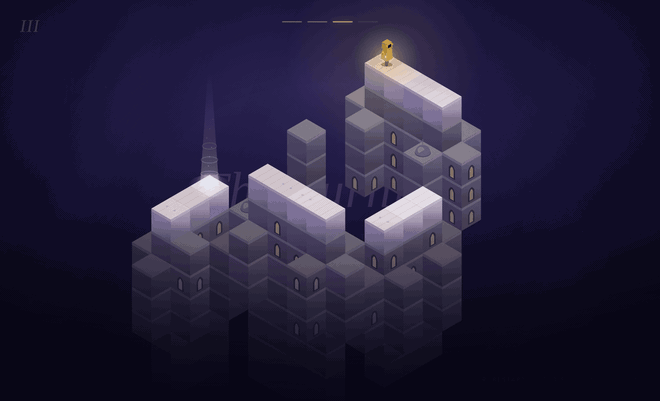

# The Turning

A girl walks through impossible architecture and never stops walking. You cannot move her.
You can only turn the world — and in this world, **what looks connected is connected**.

**▶ Play:** https://YOUR-USERNAME.github.io/the-turning/ &nbsp;·&nbsp; *(see [UPLOAD.md](UPLOAD.md) to put it there)*



---

## The rules, in plain language

This is the whole system. There is nothing else.

**The world has one rule.**
Two blocks are walkable neighbours if they *look* next to each other on screen — no matter
how far apart they really are in space. The view is isometric, so a point moved by
(1 right, 1 up, 1 back) lands on exactly the same pixel it started on. That one coincidence
is the entire engine: distance along that axis is invisible, so a block ten steps away can
sit flush against the one under her feet. Turn the world and those coincidences rearrange.

**The girl has three rules.**

1. Keep walking the way you are walking.
2. If you can't, turn.
3. If you can't turn, turn around.

She cannot see the exit. She has no map, no memory, and no plan. She does not know you exist.
She is an **autonomous agent**: an entity that decides how to act from what is immediately
around it, with no leader and no global plan. Every escape in this game is produced by a
walker who is not trying to escape.

**The player has one verb.** Drag to turn the world. That's it.

---

## Where the emergence is

Nothing in the code describes a route, a solution, or a puzzle. There is a projection rule,
a three-line walking rule, and a pile of blocks. The *path* is not stored anywhere — it comes
into being when a rotation makes two unrelated blocks line up, and it stops existing when you
turn away. A level is solved by a creature that has no concept of solving.

The tension that makes it a game is also emergent: because she never stops and never
remembers, she will walk back across a bridge she just crossed. So you are not solving a
maze, you are **choosing a moment**. Her indifference is the difficulty.

---

## How the levels were proven

Impossible geometry is easy to draw and very easy to get wrong — two blocks line up by
accident and a puzzle becomes trivial, or a walkway becomes a junction where a memoryless
walker loops forever. So the levels are not hand-placed. They are **searched for and then
proven**, by the scripts in `tools/`:

| | |
|---|---|
| `engine.js` | the projection lattice and the walking rule |
| `search.js` | searches block placements for geometry that satisfies every constraint |
| `finalize.js` | adds the architectural mass, then re-proves nothing broke |
| `audit.js` | re-derives all of it with independent code, so the search can't certify itself |
| `playtest.js` | plays the actual built game in a real browser, start to finish |

Every level must pass all five of these:

1. **Not already solved** — the exit is unreachable at the starting rotation.
2. **Solvable** — the intended sequence of turns does reach the exit.
3. **No accidental bridges** — across all four rotations, the *only* connections between
   separate structures are the intended ones.
4. **Corridors only** — no block ever offers more than two ways on, at any rotation.
   This matters because of rule 3 above: a walker with no memory, standing at a junction,
   can loop between two branches forever and never reach the end. Forbidding junctions is
   what makes "forward, else turn, else turn around" *guaranteed* to walk a whole structure.
5. **Reachable in practice** — the built game, driven headlessly, actually finishes all four
   levels.

Constraint 4 was discovered by failure, not by foresight: level IV was unsolvable in testing
because she paced between two branches of a junction indefinitely. The fix was to constrain
the architecture rather than to give her a better brain — which is the more honest fix, since
the premise is that she has no brain to improve.

---

## Running it

It is one file with no build step and no dependencies.

```bash
python3 -m http.server 8000   # then open http://localhost:8000
```

To rebuild the levels from scratch:

```bash
cd tools
node search.js      # find geometry that satisfies every constraint
node finalize.js    # add the architecture, re-prove it, write levels.json
node audit.js       # independent verification
```

### Publishing to GitHub Pages

Step by step, with no command line needed: **[UPLOAD.md](UPLOAD.md)**.

---

## Controls

| | |
|---|---|
| drag | turn the world |
| tap | turn a quarter — left side turns left, right side turns right |
| ← → | turn in 90° steps |
| R | restart the level (or begin again, at the end) |
| T | tips — lights the two stones that are about to meet |
| M | sound on / off |

Nothing pulses at you while you play. If you stall for twenty seconds, or press **T**, the
two stones that are about to meet light up — otherwise the only guidance is the shaft of
light at the way out. The four marks at the top tell you how far down you are.

All the sound is synthesised in the browser at runtime, so the page stays a single file with
no assets: a drone that drops a little lower each level, a step, stone turning, a bell when a
turn actually opens something new, and a chord when she reaches the light.

Three details exist purely so that turning the world never breaks the illusion:

- Faces are shaded by which way they face **inside their own block**, never by where the world
  has been turned to — so rotating changes what you see, never how the stone is lit.
- Blocks are depth-sorted on a rounded key with a stable tiebreak, because the invisible axis
  puts many blocks at *identical* depth and float noise would otherwise reorder them every frame.
- The girl is built from solid boxes in the rotated frame, not drawn as a flat picture, so she
  keeps her volume from every angle and is sorted against the architecture rather than pasted
  over it. She is depth-sorted a full step forward of the block she stands on, which encodes
  the fact that a neighbour at the same height cannot cover something standing above it.

There is no linework anywhere in the world. Nothing is outlined: every block is three flat
tones of pale stone, and what separates one from the next is a shadow pooling at the foot of
each wall and fading upward, plus a lighter cornice along its head. The ornament — arched
windows lit from inside, domes with finials, paving courses cut across the walkways — is all
drawn procedurally per block from a seeded hash, so it is identical on every run and costs
nothing to author.

Three things keep it fast. Nothing is stroked (a stroke costs about fourteen times a fill).
The sky, its drifting light, the vignette and the fog at the bottom of the abyss are CSS
layers, composited once by the browser rather than repainted 60 times a second — moving them
out of the canvas took the frame from 27ms to 1.5ms. And the architecture only changes while
you are turning it, so it is painted into two cached layers, everything behind her and
everything in front, and an ordinary frame is two blits plus the few things that move. If a
machine still cannot hold 60fps, the soft shading drops first and the pixel density second.

---

## Credits

Built with Claude for *AI, Design and Creativity* (Cornell, Fall 2026), Project 1 — emergence.

The walking rule descends from Craig Reynolds's steering behaviours by way of Daniel
Shiffman's [*The Nature of Code*, chapter 5](https://natureofcode.com/autonomous-agents/).
The rotation mechanic is a debt to **Monument Valley** (ustwo games), the dark and the small
figure in it to **Little Nightmares** (Tarsier Studios), and the isometric stone to
[@coreysj's "cube surface sneks"](https://openprocessing.org/@coreysj/2904938).

No images, no libraries, no assets. Everything you see is drawn from numbers at runtime.
